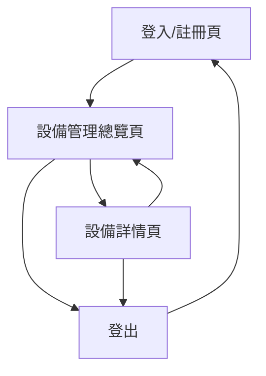

## 1. Product Overview
以「帳號」為單位管理多台設備的連線/使用/定位狀態，提供即時可視化總覽與單台設備詳情追蹤。
同時每 5 分鐘紀錄一次「登入帳號」的位置（position table），用於稽核與行動軌跡回溯。

## 2. Core Features

### 2.1 Feature Module
本產品需求由以下主要頁面構成：
1. **登入/註冊頁**：登入、註冊、忘記密碼。
2. **設備管理總覽頁**：設備清單、狀態總覽（連線/使用/定位）、篩選搜尋、帳號定位狀態（是否授權/最後回報時間）。
3. **設備詳情頁**：單台設備狀態細節、近期狀態變更/最後回報、設備位置地圖、登入帳號位置紀錄（每 5 分鐘）。

### 2.2 Page Details
| Page Name | Module Name | Feature description |
|---|---|---|
| 登入/註冊頁 | 身份驗證 | 使用 Supabase Auth 完成登入、註冊、忘記密碼（Email）。 |
| 設備管理總覽頁 | 導覽與帳號狀態 | 顯示目前登入帳號、登出；顯示定位權限狀態與「最後位置回報時間」。 |
| 設備管理總覽頁 | 設備清單 | 列出該帳號名下設備；以徽章顯示連線狀態、使用狀態、定位狀態、最後回報時間。 |
| 設備管理總覽頁 | 篩選搜尋 | 依設備名稱/代碼、狀態（連線/使用/定位）快速篩選。 |
| 設備管理總覽頁 | 帳號位置回報（背景） | 於使用者登入且頁面開啟時，每 5 分鐘取得一次瀏覽器定位並寫入 position table（含時間戳、精度）；若未授權則提示並停止寫入。 |
| 設備詳情頁 | 設備基本資訊 | 顯示設備名稱/代碼、所屬帳號、連線/使用/定位狀態、最後回報時間。 |
| 設備詳情頁 | 位置與地圖 | 顯示設備目前位置（若有）與地圖標記；提供縮放、重新置中。 |
| 設備詳情頁 | 帳號位置紀錄 | 以列表呈現 position table 最近紀錄（時間、緯度/經度、精度），支援快速跳轉地圖定位點。 |

## 3. Core Process
### 使用者流程
1. 你進入登入/註冊頁，完成登入（或註冊後登入）。
2. 你進入設備管理總覽頁，查看名下所有設備的連線/使用/定位狀態與最後回報時間，並可用篩選快速定位異常設備。
3. 當你同意瀏覽器定位權限後，系統在你保持登入且頁面開啟期間，每 5 分鐘自動寫入一次你的定位到 position table；若權限被撤回，系統提示並停止回報。
4. 你點選任一設備進入設備詳情頁，查看該設備狀態與位置地圖，同時可回顧你的帳號位置紀錄以利稽核/比對。

