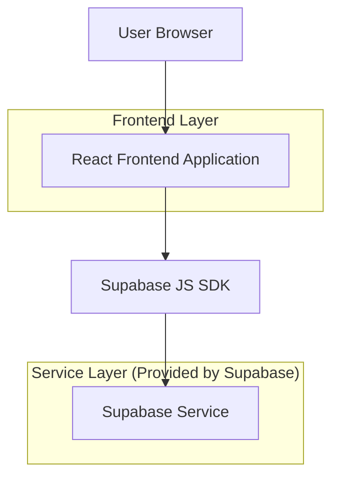
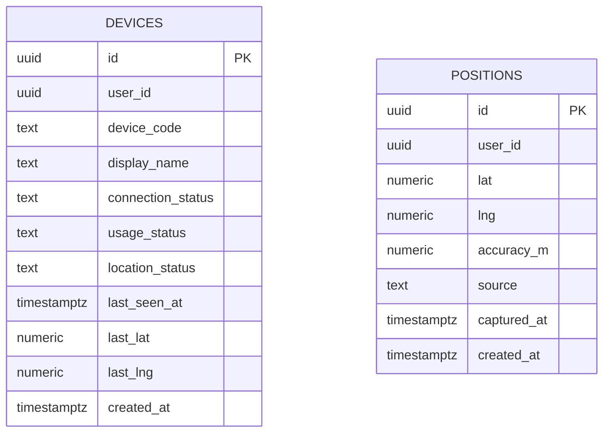

## 1.Architecture design


## 2.Technology Description
- Frontend: React@18 + vite + tailwindcss@3
- Backend: None
- BaaS: Supabase（Auth + PostgreSQL）

## 3.Route definitions
| Route | Purpose |
|---|---|
| /auth | 登入/註冊/忘記密碼 |
| / | 設備管理總覽（預設首頁，需登入） |
| /devices/:deviceId | 設備詳情（需登入） |

## 6.Data model(if applicable)

### 6.1 Data model definition


### 6.2 Data Definition Language
> 備註：position table 每 5 分鐘更新一次「登入帳號位置」，建議由前端在使用者登入且頁面開啟時以定時器觸發（瀏覽器定位僅能在用戶端取得）。

Devices Table (devices)
```
CREATE TABLE devices (
  id UUID PRIMARY KEY DEFAULT gen_random_uuid(),
  user_id UUID NOT NULL,
  device_code TEXT NOT NULL,
  display_name TEXT NOT NULL,
  connection_status TEXT NOT NULL DEFAULT 'unknown',
  usage_status TEXT NOT NULL DEFAULT 'unknown',
  location_status TEXT NOT NULL DEFAULT 'unknown',
  last_seen_at TIMESTAMPTZ,
  last_lat NUMERIC,
  last_lng NUMERIC,
  created_at TIMESTAMPTZ NOT NULL DEFAULT NOW()
);

CREATE UNIQUE INDEX idx_devices_user_device_code ON devices(user_id, device_code);
CREATE INDEX idx_devices_user_last_seen ON devices(user_id, last_seen_at DESC);

GRANT SELECT ON devices TO anon;
GRANT ALL PRIVILEGES ON devices TO authenticated;
```

Positions Table (positions)
```
CREATE TABLE positions (
  id UUID PRIMARY KEY DEFAULT gen_random_uuid(),
  user_id UUID NOT NULL,
  lat NUMERIC NOT NULL,
  lng NUMERIC NOT NULL,
  accuracy_m NUMERIC,
  source TEXT NOT NULL DEFAULT 'browser_geolocation',
  captured_at TIMESTAMPTZ NOT NULL,
  created_at TIMESTAMPTZ NOT NULL DEFAULT NOW()
);

CREATE INDEX idx_positions_user_captured ON positions(user_id, captured_at DESC);

GRANT SELECT ON positions TO anon;
GRANT ALL PRIVILEGES ON positions TO authenticated;
```

RLS（建議）
```
ALTER TABLE devices ENABLE ROW LEVEL SECURITY;
ALTER TABLE positions ENABLE ROW LEVEL SECURITY;

CREATE POLICY "devices_select_own" ON devices
  FOR SELECT TO authenticated
  USING (user_id = auth.uid());

CREATE POLICY "devices_write_own" ON devices
  FOR ALL TO authenticated
  USING (user_id = auth.uid())
  WITH CHECK (user_id = auth.uid());

CREATE POLICY "positions_select_own" ON positions
  FOR SELECT TO authenticated
  USING (user_id = auth.uid());

CREATE POLICY "positions_insert_own" ON positions
  FOR INSERT TO authenticated
  WITH CHECK (user_id = auth.uid());
```